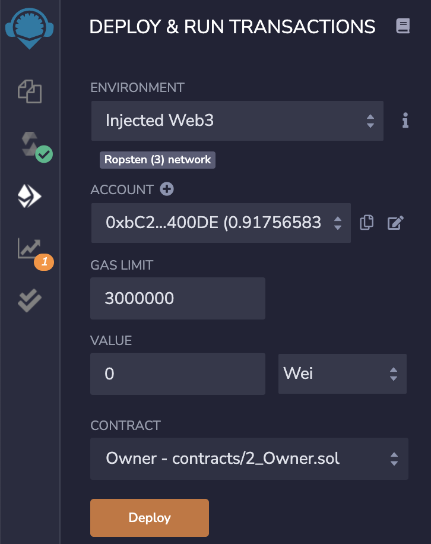
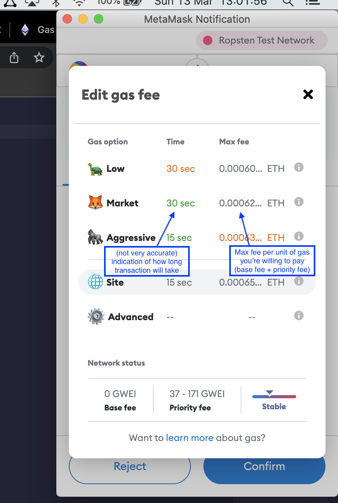
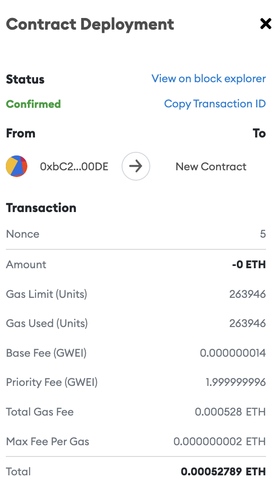
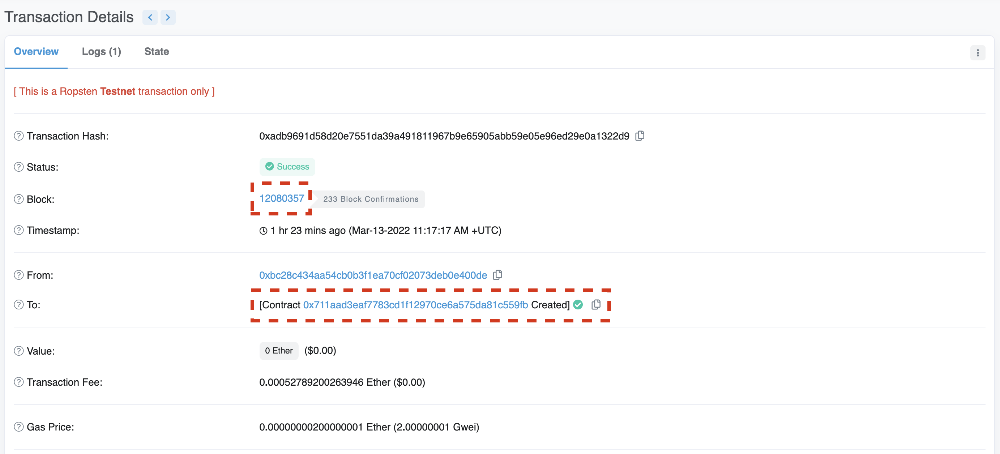
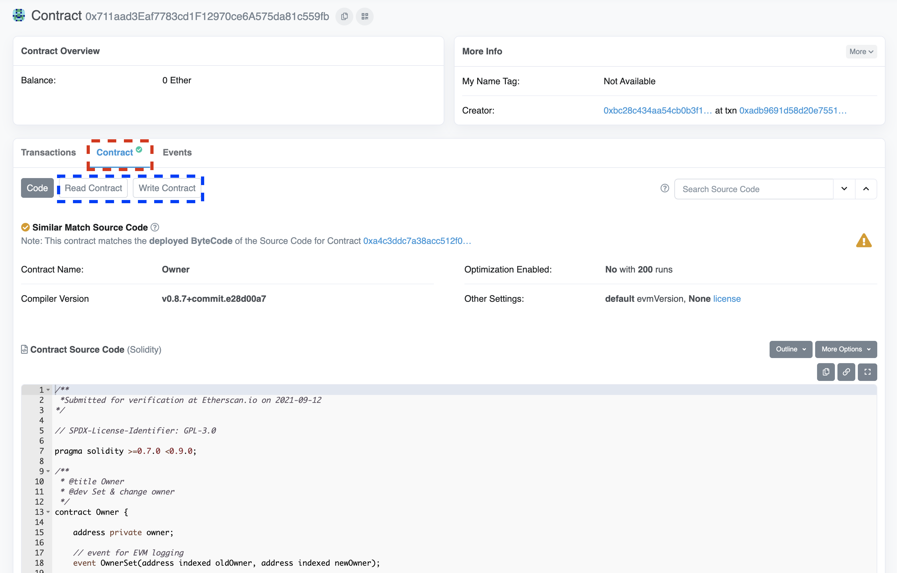
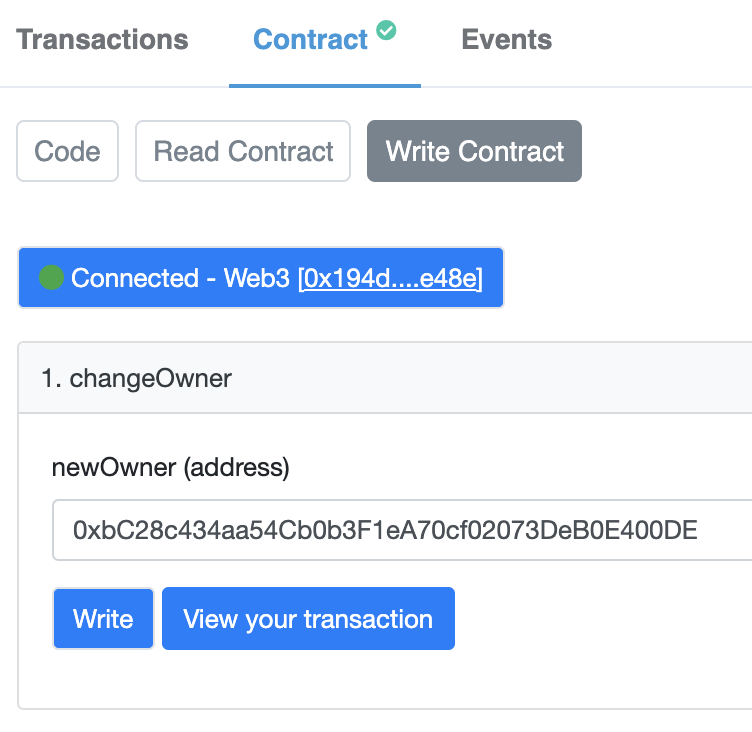

# Preparation Session 3

- Follow the steps from this tutorial to install the MetaMask browser Extension, and to create a wallet: https://www.geeksforgeeks.org/how-to-install-and-use-metamask-on-google-chrome/ (if you use a different browser, you can download the extension here: https://metamask.io/download/). You can do this on your ING computer, as well as on your private computer, if you prefer.
- You can now see an account (for example, 0xbC28c434aa54Cb0b3F1eA70cf02073DeB0E400DE, with most likely 0 ETH in it). Copy this account, and send it to me on Teams. I will make sure that you get some Test Ether (no real value, so sorry to disappoint)
- With the extension open, you can see `Ethereum Mainnet` in the top of the Extension popup. Click on this, and in the dropdown menu that appears click on `Show/hide test networks` and toggle this control to On.
- Now, in the same dropdown menu, click on `Ropsten Test Network`. This is the Ethereum test network that we will be using. After I have sent you some Test Ether, this should be visible in this window.
- You are now all set for the third session on Blockchain!

# Session 3

## Let's deploy some smart contracts!

We will use Remix IDE to write, compile, and deploy Smart Contracts for Ethereum. We will start with a very small example that is included with the IDE itself.

- Go to https://remix.ethereum.org
- In the File Explorer, check out the `contracts` folder, and then the file `2_Owner.sol`
- As you can see, we have a `contract` called `Owner`

  - The contract sets the private field `owner` to the deployer of the contract
  - The current `owner` can set the variable to a different user
  - The `owner` can be retrieved

- You can compile the 2_Owner.sol contract by right clicking on the file and clicking `compile`
- Make sure there is no error message in the second tab on the left
- In the third tab, you can deploy the contract

  - Choose `Environment: Injected Web 3`. A popup may come from MetaMask to confirm
  - Make sure that the `Account` is set to an account that has some (test) ether available (make sure that your MetaMask is set to the Ropsten test network)
  - The `Gas Limit` and `Value` can be ignored for now
  - Make sure that the `Contract` is set to `Owner - contracts/2_Owner.sol`
  - Click `Deploy`, but do not click `Confirm` yet in the MetaMask popup
  - We will dive a bit deeper into what everything means, but for now, in the MetaMask popup:
    - Click on `Site Suggested`, you are redirected within the popup to 'Edit gas fee'
    - Click on 'Market' or 'Aggresive' (the latter will cost more test Ether)
    - Click on `Confirm`
  - The deployment of the contract starts. This will take some time, so this is a good time to continue reading a bit!

## Your first transaction

You just started the deployment of your first Smart Contract. Congratulations! In the console at the bottom of the Remix IDE, you can click on `view on etherscan`. Click this to see the status of the transaction. Most likely, most of the details are 'Pending', and there is not a lot of information that you get from this page. If you click on MetaMask, you also see the Contract Deployment, with a Pending status. From experience, the deployment can take between one and ten minutes, but the speed and price of a transaction depend on a number of things.

Before we investigate this, it is good to know the basic Ether conversions that you will encounter: 1 ether = 10^9 gwei = 10^18 wei. To put that into a 'time perspective': on the Ropsten test network, it took me 30 hours to mine approximately 9 ether, and then in the following 15 hours I did not mine a single block. 9 ether should be enough for all of us for the remainder of this workshop, though. You can find me here: https://ropsten.etherscan.io/address/0x194d354f8Ac6F72cC53879812dd3c9822233e48e#mine

### What are gas price, gas limit, and all those values?

As you know from previous sessions, every transaction requires computational effort, and therefore every transaction requires a fee.

- The fundamental unit of computation in Ethereum is called 'gas'. A standard Ether transaction requires 21.000 units of gas, a Smart Contract deployment may require much more. In Ethereum Mainnet, a block has a target size of 15 million gas, but this varies with network demand.
- For every unit of gas that is used in a transaction, a fee is paid, most often denoted in gwei
- The gas fee per unit, is calculated as the `base fee + priority fee`
- In order for a transaction to be eligible for inclusion in a block, at least the base fee must be paid. This fee is determined by how 'busy' the Blockchain network currently is, and it often is only a fraction of the total fee.
- The priority fee (or tip) can be set by the user initiating the transaction, to incentivize miners to include the transaction in a block. Withouth this fee, it can take very long for a transaction to complete. This fee (often) makes up the main chunk of a transaction fee.
- The Gas Limit denotes the max units of gas used for a transaction (a security mechanism to prevent high fees from a bug or error in a Smart Contract, for example). The difference between gas units used, and gas limit, are not charged.
- Total cost of a transaction, or Total Gas Fee, therefore, becomes `gas units (max. gas limit) \* (base fee + tip)

When you deployed, and changed 'Site Suggested' to 'Market', you changed the Max Gas Fee:

This is the maximum amount of gas per unit that you are willing to pay. In general, this mainly determines the priority fee you are willing to pay, since the base fee is more stable in the test net.

For more on gas: https://ethereum.org/en/developers/docs/gas/

### My transaction is slow, now what?

- Click on the MetaMask extension and find your pending transaction
- Click on 'Speed up'
- You will be asked if you want to increase the max gas fee (i.e., increase the Priority Fee for the transaction). By default, this will be the minimum of 10%, but again you can change this.
- If you confirm, a new transaction will be started (the hash will change), and this transaction will (most likely) finish faster than the previous transaction.

## Hooray, the transaction succeeded!
Great! After some time, your transaction has been processed and it has been included in a block. You can view details of the transaction by clicking on it in MetaMask. Even more details can be found when you click on `View on block explorer`. 

Some questions:
- How much more gas did this transaction need, compared to a standard Ether transaction?
- Remember how the 'Total Gas Fee' was calculated? Check that this is (more or less) correct based on Gas Used, Base Fee, and Priority Fee. Don't forget the conversions!

When you click on 'View on block explorer', you can find the block number on which the transaction has been registered. Here you can have an inside look into the block. As you can see: everything is out in the open, but anonymous: who has mined the block, what transactions are included in the block, how much every transaction cost... it can be interesting to have a look around!  

But then, let's have a look at our own brand new contract. In Block Explorer, click on the hash after 'To:'

Here you can see your contract! Click on the 'Contract' tab to see more details.

First, you can see the code that was deployed. If you click on 'Read Contract', you can see all the exposed Read methods in the contract, in the 'Write Contract' tab, you can see all the exposed Write methods in the contract. No surprise that we have one of each.  

- Check that if you call the Read method, that the address that is returned, matches the address of your account in MetaMask.
- Ask one of your colleagues for their Account Address
- In 'Write Contract', click on 'Connect to Web3'. This should activate a MetaMask popup, and allow you to connect with your own address.
- Enter the address of your colleague, and click on 'Write'. Again, you will be asked to confirm the transaction with MetaMask.
- Make sure to increase the gas limit if you want the transaction to finish anytime soon. You can do this the same way as with the Contract Deployment!
- Confirm the transaction.

This transaction once again can take between one and ten minutes. When it has finished, you can check out the details again, to see that the amount of Gas Used, is much lower than when you first deployed the contract.  

- Now try to change the owner back to your own account. If you get an error, do not continue with the transaction! 
- What happens? Why does this happen?

So MetaMask 'protects' you from performing a transaction that may fail.
